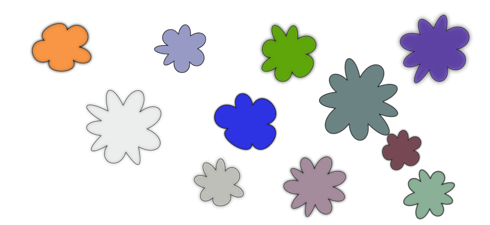
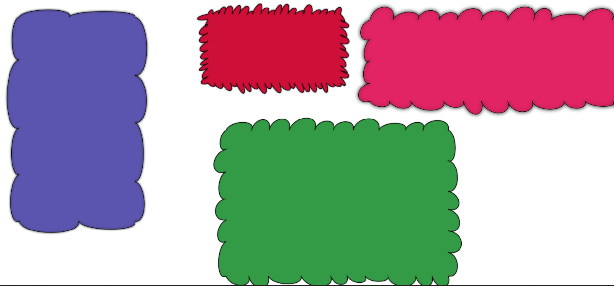

# Wiggly
Creates "Wiggly" shapes using HTML canvas element


This library provides object based canvas rendering for a variety of shapes. In addition, these shapes can be customized (and are by default) by what has been coined "Wiggles".

##### Gives you complete control over the rendering of shapes.

Each new object comes with a built in `draw()` method that makes drawing shapes a breeze.

### Wiggly Circles
``` javascript
const wiggle = new Wiggle ({
    type: 'circle',
    x1: 250,
    y1: 150,
    canvas: canvas,
    radius: Math.round(Math.random() * 40) + 30,
    wiggleSegments: Math.round(Math.random() * 5) + 5,
    shadowBlur: 10,
    color: `rgba(${Math.round(Math.random() * 255)},${Math.round(Math.random() * 255)},${Math.round(Math.random() * 255)},${Math.random()})`,
});

wiggle.draw();
```





### Wiggly Rectangles
``` javascript
const wiggle = new Wiggle({
    type: 'rectangle',
    x1: e.clientX - rect.left,
    y1: e.clientY - rect.top,
    width: Math.random() * 700 + 100,
    height: Math.random() * 700 + 100,
    canvas: canvas,
    shadowBlur: 5,
    shadowBlur: shadowBlur,
    wiggleSegments: Math.round(Math.random() * 60 + 5),
    color: `rgb(${Math.round(Math.random() * 255)},${Math.round(Math.random() * 255)},${Math.round(Math.random() * 255)})`,
})

wiggle.draw();
```


